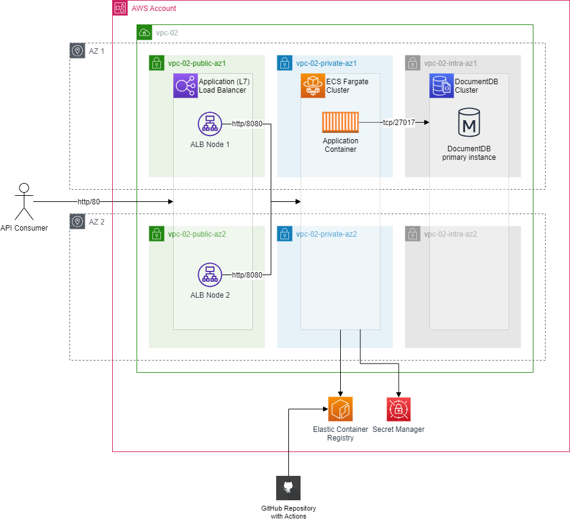

# Address Book

This is a simple service for storing and searching postal addresses.

## Deployment diagram

## How to navigate in this project

There are 3 big parts:
- [infra](infra/) contains a Terraform module for provisioning some "foundational" infrastructure.
- [dev/app](dev/app/) contains a Spring Boot application written in Kotlin which contains all the business logic.
- finally, [dev/stack](dev/stack/) contains a Java-based CDK app which provisions a DocumentDB cluster and deploys the Spring Boot application in ECS Fargate with an Application Load Balancer on top.

On top of that, there is a build pipeline for the Spring Boot application in [.github/workflows/main.yml](.github/workflows/main.yml).

## Future work

Below is a not complete list of things that can be improved in no particular order:
- Naming convention for AWS resources
- Applying a consistent set of tags to AWS resources
- All sorts of security things, for example:
    - WAF
    - TLS on both ALB and DocumentDB
    - CMKs for Secrets and encryption at rest
    - Vulnerability scans for container images
- Business continuity improvements (depending on RTO and RPO can include backups, always-active failover, cross-regional deployment, etc.)
- Search capabilities can be improved, right now can search only by exact name match (DocumentDB does not support full-text MongoDB indices)
- Logging can be improved by switching to json structured logging
- Enable tracing and correlation ids in logs
- Automated pipelines for infrastructure provisioning and deployment
- Custom library for CDK constructs to ensure proper standartization
- Configure terraform remote S3 backend (so it can be run concurrently)
- Configure linter (ktlint) and static code analyzer (detekt or SonarQube) for application code
- Tests
- Spring Boot configuration improvements
- Metric-based auto-scaling (for production-like setup)